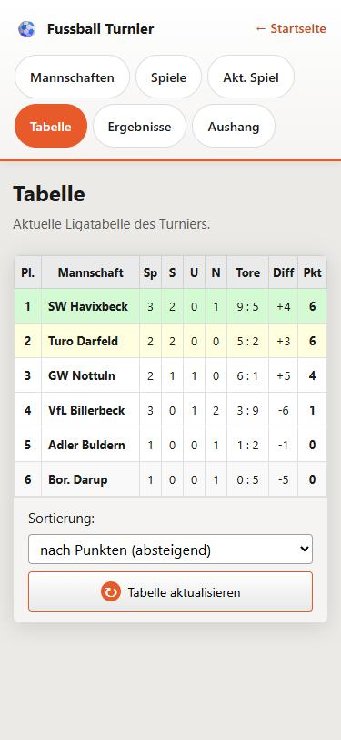

# Fussball Turnier — die Web-Anwendung

> **Kurzfassung:** Eine Turnierverwaltung, die vollständig im Browser läuft — ohne Installation, ohne Server, ohne Framework und ohne Build-Werkzeug. Sieben HTML-Seiten teilen sich eine einzige Datenschicht (`turnier-store.js`), die alle Daten in `localStorage` ablegt. Der tragende Gedanke: ==gespeichert werden nur Mannschaften und Ergebnisse==. Punkte, Siege und Platzierungen stehen nirgends in der Datei — sie werden bei jedem Lesen neu berechnet und können deshalb gar nicht erst veralten.

<figure class="schirmbild schirmbild--hoch">
  
  <figcaption>Die Startseite: Poster, sechs Menükacheln, darunter die Eckdaten des Turniers. Diese drei Zeilen sind nicht fest eingetragen — sie stammen aus den Turnier-Angaben, die auf der Aushang-Seite gepflegt werden. Das Datum im Poster selbst gehört dagegen zur Bilddatei und bleibt stehen.</figcaption>
</figure>

---

## 🧭 Was die Anwendung ist

Die Anwendung ist die Browser-Schwester der Delphi-Turnierverwaltung *FussballTurnier 2.0*. Sie macht dasselbe — Mannschaften erfassen, Ergebnisse eintragen, Tabelle führen — braucht dafür aber nur einen Browser. Keine Installation, kein Setup, keine Laufzeitumgebung. Man kopiert den Ordner auf einen Stick und öffnet `index.html`.

| Seite | Datei | Wozu |
|---|---|---|
| Start | `index.html` | Poster und Menü mit sechs Kacheln |
| Mannschaften | `mannschaften.html` | Teams anlegen, umbenennen, löschen; Demo-Daten; Sichern/Laden |
| Spiele | `spiele.html` | Begegnungen frei wählen, Ergebnis eintragen, bearbeiten, löschen |
| Akt. Spiel | `aktspiel.html` | Große Live-Anzeige für Zuschauer (Beamer) |
| Tabelle | `tabelle.html` | Ligatabelle mit Platzierungsfarben |
| Ergebnisse | `ergebnisse.html` | Nur-Lesen-Liste aller Partien |
| Aushang | `aushang.html` | Druckfertige A4-Übersicht für den Schaukasten |

---

## 📦 Woraus sie besteht

```
TabelleFTV/
├── index.html  mannschaften.html  spiele.html
├── aktspiel.html  tabelle.html  ergebnisse.html  aushang.html
├── assets/
│   ├── turnier-poster.jpg      Poster der Startseite
│   └── logorw96.png            Signatur im Aushang-Kopf
├── css/
│   ├── global.css              Farbvariablen, Grundschrift, box-sizing
│   ├── layout.css              Kopfzeile, Navigation, Seitenrahmen
│   └── start / mannschaften / spiele / tabelle / aushang / aktspiel .css
└── js/
    ├── turnier-store.js        die Datenschicht (490 Zeilen)
    ├── nav.js                  markiert den aktiven Menüpunkt (7 Zeilen)
    ├── datentransfer.js        Sichern und Laden als .json
    └── start / mannschaften / spiele / tabelle / ergebnisse / aushang / aktspiel .js
```

Keine Abhängigkeit von außen: kein jQuery, kein React, kein npm, kein Bundler. Jede Seite lädt zwei bis vier `<script>`-Dateien und fertig. Das ist Absicht — die Anwendung soll in fünf Jahren noch funktionieren, wenn niemand mehr weiß, welche Werkzeugversion sie einmal gebaut hat.

---

## 🔑 Die eine wichtige Entscheidung

In einer Turnierverwaltung gibt es eine klassische Fehlerquelle: Man speichert die Tabelle *und* die Ergebnisse. Dann korrigiert jemand ein Ergebnis, die Tabelle wird vergessen — und beides widerspricht sich. In Datenbank-Sprache: redundante Daten laufen auseinander.

Diese Anwendung umgeht das Problem, indem sie die Tabelle gar nicht erst speichert. Sie rechnet sie **bei jedem einzelnen Lesezugriff** neu aus den Ergebnissen:

```js
function aktualisiereStatistikAusSpielen(teams, spiele) {
  const byId = new Map(
    teams.map((t) => [t.id, { ...t, spiele: 0, siege: 0, unentschieden: 0,
      niederlagen: 0, toreErzielt: 0, toreErhalten: 0, punkte: 0 }])
  );

  for (const s of spiele) {
    const heim = byId.get(s.heimId);
    const gast = byId.get(s.gastId);
    if (!heim || !gast) continue;
    // … Spiele und Tore hochzählen, dann:
    if (th > tg)      { heim.siege += 1; heim.punkte += 3; gast.niederlagen += 1; }
    else if (th < tg) { gast.siege += 1; gast.punkte += 3; heim.niederlagen += 1; }
    else              { heim.unentschieden += 1; gast.unentschieden += 1;
                        heim.punkte += 1; gast.punkte += 1; }
  }
  return teams.map((t) => byId.get(t.id) || t);
}
```

Jedes Team wird zuerst auf null zurückgesetzt, dann laufen alle Spiele durch. Drei Punkte für den Sieg, einer fürs Unentschieden. Das kostet bei zwanzig Teams und hundert Spielen weniger als eine Millisekunde — und dafür ==kann die Tabelle prinzipiell nicht falsch sein==.

---

## 🗄️ Das Datenmodell

Alles liegt unter einem einzigen Schlüssel im `localStorage`:

```js
const STORAGE_KEY = "ftv-turnier-v1";
```

Der Inhalt ist ein JSON-Objekt mit vier Feldern:

```json
{
  "version": 2,
  "meta":   { "turnierName": "Stadtmeisterschaft 2026",
              "ort": "Sportplatz Musterstadt",
              "datum": "2026-07-18" },
  "teams":  [ { "id": "a1b2…", "name": "FC Linden", "punkte": 16, "…": "…" } ],
  "spiele": [ { "id": "c3d4…", "heimId": "a1b2…", "gastId": "e5f6…",
                "toreHeim": 3, "toreGast": 1, "erstelltAm": "2026-07-18T14:20:00Z" } ]
}
```

Wichtig zu verstehen: Die Statistikfelder in `teams` (`punkte`, `siege`, `toreErzielt` …) werden zwar **mitgeschrieben**, aber beim Lesen **nie geglaubt**. Sie sind nur ein Abfallprodukt des Schreibvorgangs. Maßgeblich ist immer `spiele`.

Mannschaften und Spiele werden über **IDs** verknüpft, nicht über Namen. Deshalb kann man eine Mannschaft umbenennen, ohne dass ihre Ergebnisse verloren gehen — ein Punkt, den die Oberfläche auch ausdrücklich zusagt.

Die IDs kommen aus:

```js
function neueId() {
  if (global.crypto && crypto.randomUUID) return crypto.randomUUID();
  return "id-" + Date.now() + "-" + Math.random().toString(36).slice(2, 9);
}
```

Also eine echte UUID, wo der Browser sie anbietet, sonst ein Zeitstempel mit Zufallsanhang. Der Rückfallweg ist nötig, weil `crypto.randomUUID` nur in sicheren Kontexten existiert — beim Öffnen per `file://` ohne Server fehlt es.

---

## 🔄 Der Lese- und Schreibzyklus


Es gibt genau zwei Funktionen, die `localStorage` berühren. Alles andere geht durch sie hindurch.

**Lesen** — `leseSpeicher()`:

```js
function leseSpeicher() {
  try {
    const raw = localStorage.getItem(STORAGE_KEY);
    if (!raw) return { version: 2, meta: {}, teams: [], spiele: [] };
    const data = JSON.parse(raw);
    if (!data || !Array.isArray(data.teams)) return { version: 2, meta: {}, teams: [], spiele: [] };
    const spiele = Array.isArray(data.spiele) ? data.spiele : [];
    let teams = data.teams;
    const bereinigt = bereinigeSpiele(teams, spiele);
    teams = aktualisiereStatistikAusSpielen(teams, bereinigt);
    const meta = data.meta && typeof data.meta === "object" ? data.meta : {};
    return { version: 2, meta, teams, spiele: bereinigt };
  } catch {
    return { version: 2, meta: {}, teams: [], spiele: [] };
  }
}
```

Drei Dinge passieren hier, und alle drei sind bewusst gesetzt:

- 🧹 **Selbstheilung.** `bereinigeSpiele()` wirft jedes Spiel weg, dessen Mannschaften es nicht mehr gibt, das gegen sich selbst gespielt wurde oder dessen Tore keine Zahlen sind. Kaputte Daten verschwinden beim nächsten Zugriff von allein.
- 🔢 **Neuberechnung.** Direkt danach läuft die Statistik neu durch.
- 🛟 **Kein Absturz.** Der `catch`-Zweig fängt alles ab — defektes JSON, abgeschalteten `localStorage`, privaten Modus. Im schlimmsten Fall startet die Anwendung leer statt gar nicht.

**Schreiben** — `schreibeSpeicher()` läuft dieselbe Kette noch einmal, bevor es ablegt:

```js
function schreibeSpeicher(state) {
  const spiele = bereinigeSpiele(state.teams, state.spiele);
  const teams = aktualisiereStatistikAusSpielen(state.teams, spiele);
  localStorage.setItem(
    STORAGE_KEY,
    JSON.stringify({ version: 2, meta: state.meta || {}, teams, spiele })
  );
}
```

Dadurch ist es unmöglich, einen widersprüchlichen Zustand in den Speicher zu bekommen — egal, welche Funktion ihn aufgerufen hat.

---

## 🧩 Wie die Seiten mit dem Store reden

`turnier-store.js` ist ein **IIFE** (eine Funktion, die sich selbst sofort ausführt). Dadurch bleiben alle internen Funktionen privat; nach außen hängt genau ein Objekt am `window`:

```js
(function (global) {
  /* … alles Interne … */
  global.TurnierStore = {
    getMannschaften, getSpiele, getSpieleMitNamen, setMannschaften,
    addMannschaft, updateMannschaftName, removeMannschaft,
    addSpiel, updateSpiel, removeSpiel,
    ladeDemoMannschaften, createMannschaft,
    getTabelle, getMeta, setMeta,
    exportState, exportDateiname, importState, importStateAusDatei,
  };
})(window);
```

Das ist die vollständige Schnittstelle. Keine Seite liest oder schreibt `localStorage` selbst — wenn sich das Speicherformat je ändert, ist nur diese eine Datei betroffen.

Ein wiederkehrendes Muster: ==Schreibende Funktionen geben kein nacktes Ergebnis zurück, sondern ein Statusobjekt.==

```js
function addMannschaft(name) {
  const trimmed = name.trim();
  if (!trimmed) return { ok: false, error: "Bitte einen Mannschaftsnamen eingeben." };
  const state = leseSpeicher();
  if (state.teams.some((t) => t.name.toLowerCase() === trimmed.toLowerCase())) {
    return { ok: false, error: "Diese Mannschaft existiert bereits." };
  }
  state.teams.push(createMannschaft(trimmed));
  schreibeSpeicher(state);
  return { ok: true, teams: getMannschaften() };
}
```

Die Fehlermeldung ist damit **im Store formuliert**, nicht in der Oberfläche. Jede Seite macht nur noch:

```js
const result = TurnierStore.addMannschaft(inputNeu.value);
if (!result.ok) { showMessage(result.error, "error"); return; }
```

Dadurch sagen alle Seiten bei demselben Problem dasselbe, und die Regeln stehen an einer Stelle statt verteilt in sechs Dateien.

### Seitenskripte

| Seite | Skript | Besonderheit |
|---|---|---|
| index | `start.js` | holt Turniername/Ort/Datum für die Fußzeile |
| mannschaften | `mannschaften.js` + `datentransfer.js` | Namensfelder speichern bei `change` |
| spiele | `spiele.js` | ein Formular für Neuanlage *und* Bearbeitung (`editingId`) |
| aktspiel | `aktspiel.js` | eigener, flüchtiger Spielstand |
| tabelle | `tabelle.js` | Zeilenfarben nach Platz, anklickbare Markierung |
| ergebnisse | `ergebnisse.js` | reine Ausgabe |
| aushang | `aushang.js` + `datentransfer.js` | Druckansicht und Metadaten |

Dazu auf jeder Seite `nav.js` — sieben Zeilen, die den aktiven Menüpunkt einfärben:

```js
const page = document.body.dataset.page;
const link = document.querySelector(`.main-nav a[data-nav="${page}"]`);
if (link) link.classList.add("is-active");
```

Jede Seite trägt dafür ein `data-page="spiele"` am `<body>`. Kein Routing, kein Zustand — ein Attribut genügt.

---

## 🏆 Die Tabellenberechnung

```js
function getTabelle() {
  const teams = getMannschaften().map((m) => ({ ...m, tordifferenz: m.toreErzielt - m.toreErhalten }));
  teams.sort((links, rechts) => {
    if (links.punkte !== rechts.punkte) return rechts.punkte - links.punkte;
    if (links.tordifferenz !== rechts.tordifferenz) return rechts.tordifferenz - links.tordifferenz;
    if (links.toreErzielt !== rechts.toreErzielt) return rechts.toreErzielt - links.toreErzielt;
    return links.name.localeCompare(rechts.name, "de");
  });
  return teams.map((m, i) => ({ ...m, platz: i + 1 }));
}
```

Die Rangfolge: **Punkte → Tordifferenz → erzielte Tore → Name**. Das letzte Kriterium sorgt dafür, dass die Reihenfolge bei völlig gleichen Teams stabil und nicht zufällig ist; `localeCompare(…, "de")` sortiert dabei Umlaute richtig ein.

Diese Funktion wird von *beiden* Tabellenansichten benutzt — der Seite `tabelle.html` und dem Aushang. Sie können deshalb keine unterschiedlichen Platzierungen zeigen.

<figure class="schirmbild">
  
  <figcaption>Die Tabellenseite. Platz 1 bis 3 sind farblich abgesetzt, darunter läuft ein Zebramuster. Dass „Bor. Darup“ mit nur einem Spiel vor „SW Havixbeck“ steht, ist die Tordifferenz: +5 gegen +1 bei gleichen 3 Punkten.</figcaption>
</figure>

---

## 💾 Sichern und Laden

`localStorage` lebt nur in einem Browser auf einem Rechner. Wer den Cache leert, verliert das Turnier. Deshalb gibt es Export und Import als `.json`-Datei.

`datentransfer.js` ist bewusst **nicht an bestimmte Seiten gebunden**, sondern an Markup-Attribute. Das Skript sucht beim Laden:

```js
const btnExport = document.querySelector('[data-aktion="export"]');
const btnImport = document.querySelector('[data-aktion="import"]');
const dateiFeld = document.querySelector('[data-rolle="import-datei"]');
```

Wer die Knöpfe auf einer weiteren Seite haben will, schreibt dort dieselben Attribute hin und bindet die Datei ein — mehr ist nicht nötig. Aktuell nutzen das `mannschaften.html` und `aushang.html`.

Der **Export** baut einen Blob und klickt einen unsichtbaren Link an:

```js
const blob = new Blob([JSON.stringify(daten, null, 2)], { type: "application/json;charset=utf-8" });
const url = URL.createObjectURL(blob);
const a = document.createElement("a");
a.href = url;
a.download = TurnierStore.exportDateiname();
document.body.appendChild(a);
a.click();
a.remove();
setTimeout(() => URL.revokeObjectURL(url), 1000);
```

`exportDateiname()` baut daraus einen sprechenden Namen wie `turnier-stadtmeisterschaft-2026-10-09.json` — inklusive Umlautumschrift (`ä → ae`), damit der Name auf jedem Dateisystem funktioniert.

Der **Import** ist der kritische Teil, denn hier kommen fremde Daten herein. `importState()` glaubt deshalb nichts:

- ⚠️ Fehlt `app: "ftv-turnier"` oder steht etwas anderes drin → abgelehnt.
- ⚠️ Mannschaften ohne Namen oder mit doppeltem Namen → übersprungen.
- ⚠️ Doppelte IDs → bekommen eine neue ID.
- ⚠️ Tore, die keine ganzen Zahlen zwischen 0 und 99 sind → Spiel verworfen.
- ⚠️ Spiele, deren Mannschaften fehlen → fallen beim anschließenden `schreibeSpeicher()` durch `bereinigeSpiele()` heraus.

Gelesen wird über einen `FileReader`, in ein Promise verpackt, damit der Aufrufer `await` benutzen kann:

```js
function importStateAusDatei(file) {
  return new Promise((resolve) => {
    const reader = new FileReader();
    reader.onerror = () => resolve({ ok: false, error: "Die Datei konnte nicht gelesen werden." });
    reader.onload = () => {
      let data;
      try { data = JSON.parse(String(reader.result)); }
      catch { return resolve({ ok: false, error: "Die Datei ist kein gültiges JSON." }); }
      resolve(importState(data));
    };
    reader.readAsText(file, "utf-8");
  });
}
```

---

## 📋 Der Aushang

`aushang.html` zeigt oben eine Bedienleiste und darunter ein „Blatt" — und das Blatt ist bereits genau das, was der Drucker ausgibt. Keine getrennte Druckvorlage, keine Überraschung beim Ausdruck.

Möglich macht das ein `@media print`-Block in `css/aushang.css`:

```css
@media print {
  @page { size: A4 portrait; margin: 14mm; }
  .no-print, .app-header { display: none !important; }
  .aushang-blatt { border: none; box-shadow: none; padding: 0; }
  .aushang-block { break-inside: avoid; }
  .aushang-tabelle tbody tr, .aushang-ergebnisse li { break-inside: avoid; }
  .aushang-tabelle thead { display: table-header-group; }
}
```

Vier Dinge sind hier entscheidend: `@page` setzt Format und Rand, `.no-print` blendet alle Bedienelemente aus, `break-inside: avoid` verhindert Tabellenzeilen, die mitten durchgeschnitten werden, und `display: table-header-group` wiederholt die Kopfzeile, falls die Tabelle doch einmal über zwei Seiten geht.

<figure class="schirmbild">
  
  <figcaption>Der Aushang, wie er aus dem Drucker kommt: Turniername, Ort und Datum im Kopf, darunter Tabelle und Ergebnisse. Die Ergebnisliste ist zweispaltig, damit ein Turnier auf eine Seite passt.</figcaption>
</figure>

Die Turnier-Angaben (Name, Ort, Datum) liegen im `meta`-Feld des Speichers und werden sofort beim Tippen übernommen:

```js
feldName.addEventListener("input", () => {
  TurnierStore.setMeta({ turnierName: feldName.value });
  renderKopf();
});
```

Das Datum wird für die Anzeige übersetzt — aus `2026-07-18` wird „Samstag, 18. Juli 2026" — über `Intl.DateTimeFormat("de-DE", …)`. Die Uhrzeit-Ergänzung `+ "T12:00:00"` beim Umwandeln ist kein Schönheitsfehler, sondern Absicht: Ohne sie legt JavaScript das Datum auf Mitternacht UTC, und westlich von Greenwich stünde dann der Vortag da.

---

## 🔴 Die Seite „Akt. Spiel"

Diese Seite ist der Beamer-Auftritt für die Zuschauer: dunkler Hintergrund, riesiger Spielstand, links und rechts die Mannschaften.

Der Anzeigebereich ist ein Raster aus **drei Zonen**, damit die Begegnung immer in der Mitte sitzt, egal wie hoch das Bild ist:

```css
.live-anzeige {
  display: grid;
  grid-template-rows: auto 1fr auto;   /* Uhr · Spiel · nächstes Spiel */
}
```

Oben rechts läuft die **Uhrzeit** (Stunde:Minute), unten steht die **nächste Begegnung**. Beide bleiben sichtbar, wenn die Steuerung ausgeblendet ist — sie gehören zum Zuschauerbild, nicht zur Bedienung.

Die Uhr schreibt nur dann ins DOM, wenn sich die Minute tatsächlich geändert hat:

```js
function renderUhr() {
  const text = new Date().toLocaleTimeString("de-DE", { hour: "2-digit", minute: "2-digit" });
  if (uhrEl.textContent !== text) uhrEl.textContent = text;   // 59 von 60 Aufrufen tun nichts
}
setInterval(renderUhr, 1000);
```

Das **nächste Spiel** wird über zwei weitere Auswahlfelder in der Steuerung gesetzt, die zusätzlich einen Eintrag „— offen —" haben. Erst wenn beide Mannschaften gewählt und verschieden sind, erscheint die Fußzeile. Der Knopf ⬆ (oder die Taste `N`) holt die Paarung nach oben: Sie wird zum laufenden Spiel, der Stand geht auf 0:0, die Auswahl unten wird wieder frei.

<figure class="schirmbild">
  
  <figcaption>Die Live-Anzeige mit ausgeblendeter Steuerung — so sehen die Zuschauer sie. Uhrzeit oben rechts, Spielstand in der Mitte, nächste Begegnung unten. Die Tor-Knöpfe bleiben halbtransparent stehen, unten rechts wartet der Knopf für die Steuerung.</figcaption>
</figure>

**Der Spielstand wird bewusst nicht gespeichert.** Er ist eine ganz normale Variable:

```js
/** Flüchtiger Spielstand – absichtlich ohne localStorage. */
const stand = { heim: 0, gast: 0 };
```

Erst der Knopf *Als Ergebnis übernehmen* schreibt ihn über `TurnierStore.addSpiel()` ins Turnier. Bis dahin sieht die Tabelle nichts davon — was richtig ist, denn ein laufendes Spiel ist noch kein Ergebnis.

**Die Schriftgrößen** skalieren mit dem Fenster, damit dieselbe Seite auf Handy und Beamer funktioniert:

```css
.live-stand      { font-size: clamp(3.5rem, 15vw, 15rem); }
.live-team__name { font-size: clamp(1.3rem, 4.2vw, 4.5rem); }
```

`clamp(min, wunsch, max)` heißt: nimm 15 % der Fensterbreite, aber nie weniger als 3,5 rem und nie mehr als 15 rem. Auf einem 1280 Pixel breiten Beamerbild ergibt das 192 Pixel hohe Ziffern.

**Das Ausblenden** läuft über eine einzige Klasse am `<body>`:

```css
body.live-ohne-steuerung .live-verbergbar { display: none !important; }
```

Alles, was verschwinden soll, trägt im HTML die Klasse `live-verbergbar` — Kopfzeile, Navigation, Mannschaftsauswahl. Die Tor-Knöpfe tragen sie bewusst **nicht**, denn sonst könnte man während des Spiels nichts mehr eintragen. Sie bleiben halbtransparent stehen.

---

## ⌨️ Eine Lehre aus der Tastatursteuerung

Die Seite lässt sich per Taste bedienen: `1` Tor Heim, `2` Tor Gast, mit `Shift` zurücknehmen. Der erste Versuch prüfte das erzeugte **Zeichen**:

```js
case "1": aendereTore("heim", 1); break;
case "!": aendereTore("heim", -1); break;   // ❌ funktioniert nicht zuverlässig
```

Das ging schief: `Shift`+`1` hat ein Tor **addiert** statt zurückgenommen. Grund ist, dass `event.key` das Zeichen liefert, das die Tastenkombination *erzeugt* — und das hängt vom Tastaturlayout ab. Auf deutschen und amerikanischen Tastaturen ist es `!`, bei manchen Eingabequellen bleibt es schlicht `1`. Die Lösung ist, die **physische Taste** abzufragen:

```js
// e.code statt e.key: unabhängig von Tastaturlayout und Shift-Zeichen
const delta = e.shiftKey ? -1 : 1;

switch (e.code) {
  case "Digit1": case "Numpad1": aendereTore("heim", delta); break;
  case "Digit2": case "Numpad2": aendereTore("gast", delta); break;
  case "KeyH": /* Steuerung umschalten */ break;
  case "KeyF": /* Vollbild */ break;
  case "KeyN": /* nächstes Spiel hochholen */ break;
}
```

> 💡 **Merksatz:** `event.key` für Texteingaben, `event.code` für Tastenkürzel. Sobald `Shift`, `Alt` oder ein fremdes Layout im Spiel sind, ist `key` nicht mehr das, was man gedrückt hat.

---

## 🔗 Wie die Seiten synchron bleiben

Es gibt zwei Wege, auf denen eine Seite merkt, dass sich etwas geändert hat:

```js
window.addEventListener("turnier:geaendert", render);       // eigene Seite, z. B. nach Import
window.addEventListener("storage", (e) => {                 // anderer Tab oder anderes Fenster
  if (e.key === "ftv-turnier-v1") render();
});
```

Das `storage`-Ereignis ist eine Eigenheit des Browsers: Es feuert **nur in den anderen Tabs**, nie in dem, der geschrieben hat. Genau deshalb braucht es zusätzlich das selbstgebaute `turnier:geaendert`, das `datentransfer.js` nach einem Import auslöst.

Praktischer Nebeneffekt: Man kann die Tabelle auf einem zweiten Bildschirm offen lassen, während man im ersten Fenster Ergebnisse eingibt — sie aktualisiert sich von selbst.

---

## 🎨 Das CSS-Gerüst

Drei Ebenen, konsequent getrennt:

1. **`global.css`** — Farbvariablen, Grundschrift, `box-sizing: border-box`. Hier stehen die Markenfarben:
   ```css
   :root {
     --color-orange: #e85a2a;  --color-orange-dark: #c94a1f;
     --color-ink: #1a1a1a;     --color-paper: #eceae6;
     --radius: 8px;
   }
   ```
2. **`layout.css`** — Kopfzeile, Navigationspillen, Seitenrahmen. Alles, was auf jeder Unterseite gleich aussieht.
3. **Eine Datei je Seite** — nur das, was wirklich nur dort vorkommt.

Weil die Farben Variablen sind, ändert ein einziger Wert in `global.css` das Erscheinungsbild der gesamten Anwendung.

Die Live-Anzeige weicht bewusst ab: dunkelblauer Grund `#2b3a4a` — dieselbe Farbe wie die Fußzeile der Delphi-Version. Aus Entfernung liest sich heller Text auf dunklem Grund deutlich besser als umgekehrt.

---

## 🔬 Sicherheit und Datenschutz

Zwei Dinge sind erwähnenswert, obwohl die Anwendung rein lokal läuft:

- **Mannschaftsnamen werden nie als HTML eingesetzt.** Wo Tabellen über `innerHTML` gebaut werden, läuft der Name vorher durch `escapeHtml()`; in den neueren Dateien (`aushang.js`, `aktspiel.js`) wird durchgängig `textContent` benutzt, das gar nicht erst interpretiert. Ein Team namens `<script>…` bleibt damit ein harmloser Text.
- **Es verlässt nichts den Rechner.** Kein Server, keine Statistikdienste, keine Schriftart von einem fremden Anbieter, keine einzige Netzwerkanfrage. Die Exportdatei entsteht lokal im Arbeitsspeicher des Browsers.

---

## 📱 Auf dem Handy

Die Anwendung ist durchgehend für kleine Schirme ausgelegt. Drei Dinge waren dafür nötig:

**Die Tabelle.** Sie hatte feste Spaltenbreiten von zusammen 320 px — bei 375 px Schirmbreite blieben für die sechs Statistikspalten je **3 Pixel** übrig, die Zahlen lagen übereinander. Jetzt trägt jeder Spaltenkopf beide Beschriftungen, und das Stylesheet entscheidet:

```html
<th class="col-sp"><span class="th-lang">Spiele</span><span class="th-kurz" title="Spiele">Sp</span></th>
```

```css
.th-kurz { display: none; }

@media (max-width: 820px) {
  .th-lang { display: none; }
  .th-kurz { display: inline; }
}
```

Der Umschaltpunkt liegt bei 820 px und nicht beim Handy: Die Tabelle ist auf 780 px gedeckelt, und unterhalb von rund 780 px Fensterbreite bleiben je Spalte weniger als die nötigen 71 px für „Unentsch." übrig. Die Spalte „Torverhältnis" bekommt die Kurzform dauerhaft — sie bräuchte 92 px, hat aber auch am großen Schirm nur 71.

**Eingabefelder mit 16 px.** Darunter zoomt iOS Safari beim Antippen automatisch hinein und lässt die Seite verschoben zurück. Die Regel braucht `!important`, weil die Seiten-Stylesheets `font: inherit` mit höherer Spezifität setzen.

**Die Live-Anzeige dreht die Reihenfolge um.** Auf dem Telefon schob die Steuerleiste den Spielstand unter den Bildschirmrand. Unter 768 px wird deshalb per `order` getauscht — erst die Anzeige, darunter die Auswahlfelder — und die Tastenliste entfällt, weil ein Telefon keine Tastatur hat.

<figure class="schirmbild schirmbild--hoch">
  
  <figcaption>Dieselbe Tabelle auf 375 Pixeln Breite: Kurzbezeichner, alle sechs Mannschaften vollständig lesbar, kein seitliches Scrollen.</figcaption>
</figure>

Dazu ein `manifest.webmanifest`, mit dem sich die Seite als Symbol auf den Startbildschirm legen lässt und dann ohne Browserleiste startet.

---

## ⚠️ Stolpersteine beim Entwickeln

| Stolperstein | Was passiert | Abhilfe |
|---|---|---|
| `event.key` bei Tastenkürzeln | Shift-Kombination löst die falsche Aktion aus | `event.code` + `event.shiftKey` |
| `python -m http.server` | liefert `304 Not Modified`, geänderte CSS bleibt unsichtbar | Adresse mit `?v=2` aufrufen oder hart neu laden |
| `new Date("2026-07-18")` | gilt als Mitternacht UTC → in manchen Zeitzonen der Vortag | `+ "T12:00:00"` anhängen |
| `crypto.randomUUID` | fehlt beim Öffnen per `file://` | Rückfallweg mit Zeitstempel |
| `font: inherit` auf Feldern | die globale 16-px-Regel fürs Handy greift nicht, iOS zoomt beim Tippen hinein | `!important` oder gleiche Spezifität |
| `display: flex` + `hidden` | das HTML-Attribut `hidden` wirkt nicht mehr, das Element bleibt sichtbar | eigene Regel `.klasse[hidden] { display: none; }` |
| `escapeHtml()` | steht dreimal identisch in verschiedenen Dateien | noch offen, gehört in eine gemeinsame Datei |

---

## 🚧 Grenzen und was noch fehlt

| Thema | Stand |
|---|---|
| Gruppen A/B und KO-Runde | fehlt — die Delphi-Version kann es, die Web-Version noch nicht |
| Sortier-Auswahl auf `tabelle.html` | hat nur eine Option — ein totes Bedienelement |
| Anstoßzeit und Spielfeld | nicht vorgesehen |
| Spieluhr auf „Akt. Spiel" | nur die Tageszeit wird angezeigt; eine mitlaufende Spielzeit mit Halbzeit fehlt |
| Veranstalter-Logo und -Name | in der Delphi-Version vorhanden, hier nur das feste Rw-Logo |
| Mehrere Geräte gleichzeitig | nicht möglich — `localStorage` ist pro Browser; Austausch nur über die Exportdatei |

---

## ✅ Fazit

Die Anwendung ist klein — rund 3.750 Zeilen in 25 Dateien, davon knapp 500 im Store — und trägt trotzdem ein vollständiges Turnier. Dass sie so überschaubar bleibt, liegt an drei Entscheidungen:

> 🎯 **Eine Datenschicht.** Nur `turnier-store.js` kennt den Speicher. Ändert sich das Format, ist eine Datei betroffen.
>
> 🎯 **Keine abgeleiteten Daten speichern.** Was man ausrechnen kann, rechnet man aus. Dann kann es nicht veralten.
>
> 🎯 **Keine Abhängigkeiten.** Was nicht da ist, kann nicht veralten, nicht brechen und keine Sicherheitslücke bekommen.

Der nächste große Schritt wären Gruppen und KO-Runde. Der Weg dahin ist frei: Ein Feld `gruppe` an der Mannschaft und ein Feld `phase` am Spiel genügen im Datenmodell — die Tabellenberechnung bekäme einen Filter, der Rest bliebe, wie er ist.

---


*Erstellt: 2026-10-09 · HTML / CSS / Vanilla JavaScript · Dokumentation mit Claude Code · Rw*
