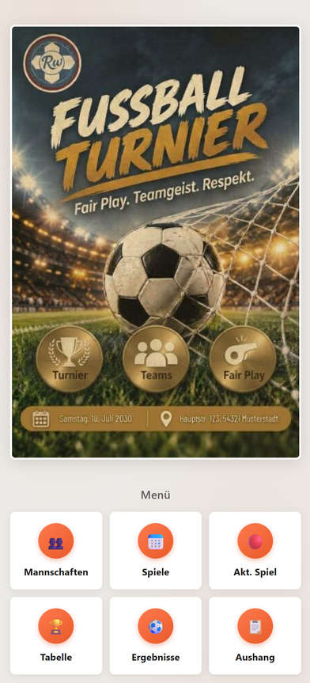
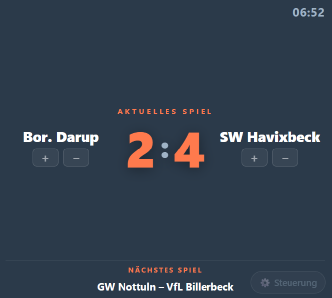
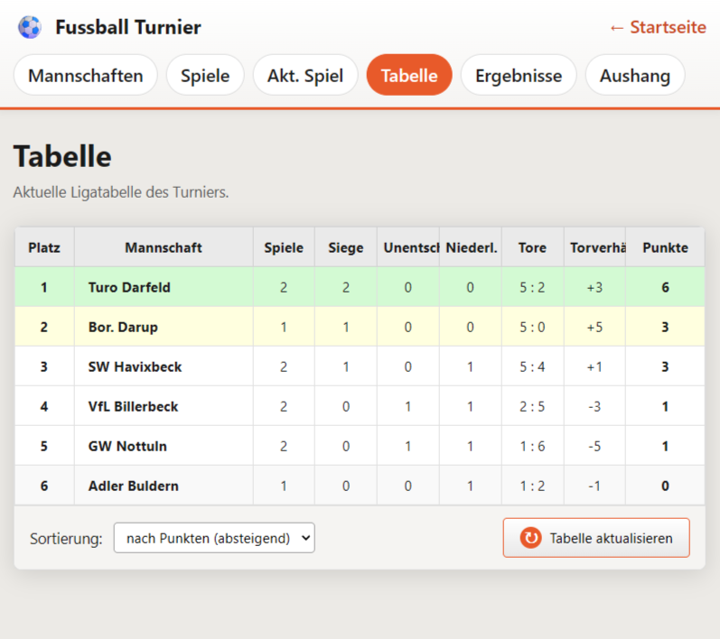
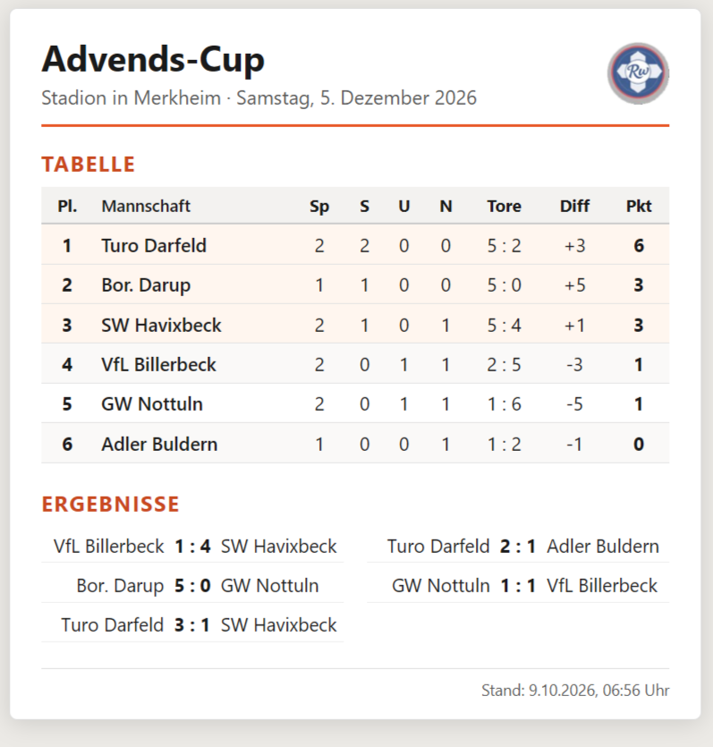
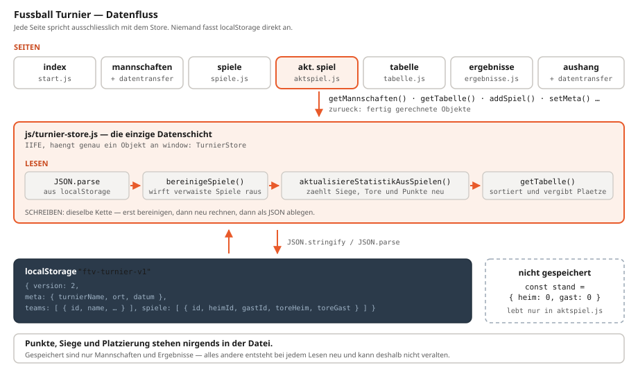

# Fussball Turnier — Web

Turnierverwaltung für Fußball-Turniere, die **vollständig im Browser** läuft: Mannschaften verwalten, Ergebnisse eintragen, Ligatabelle führen, Live-Anzeige für den Beamer und ein druckfertiger Aushang für den Schaukasten.

**Keine Installation, kein Server, kein Build-Werkzeug.** Ordner herunterladen, `index.html` öffnen — fertig. Auch vom USB-Stick.

<p align="center">
  
</p>

---

## Was sie kann

- **Mannschaften** anlegen, umbenennen und löschen — Umbenennen ändert die Statistik nicht, weil intern über IDs verknüpft wird
- **Spiele** frei zusammenstellen (Heim gegen Gast), Ergebnisse eintragen und nachträglich korrigieren
- **Tabelle** nach Punkten → Tordifferenz → erzielten Toren → Name, mit farbigen Plätzen
- **Akt. Spiel** — große Live-Anzeige für Beamer oder zweiten Bildschirm: Spielstand per Tastendruck, Uhrzeit, nächste Begegnung, Steuerung ausblendbar
- **Aushang** — A4-Seite zum Ausdrucken oder als PDF, mit Turniername, Ort und Datum
- **Sichern und Laden** des kompletten Turniers als `.json`-Datei
- Alle Seiten aktualisieren sich gegenseitig, auch über mehrere Browser-Tabs hinweg

## Die Seiten

| Seite | Zweck |
|---|---|
| `index.html` | Startseite mit Poster und Menü |
| `mannschaften.html` | Teams verwalten, Demo-Daten, Sichern/Laden |
| `spiele.html` | Begegnungen und Ergebnisse |
| `aktspiel.html` | Live-Anzeige für Zuschauer |
| `tabelle.html` | Ligatabelle |
| `ergebnisse.html` | Übersicht aller Partien |
| `aushang.html` | Druckfertige A4-Übersicht |

---

## Bilder

**Live-Anzeige** — so sehen die Zuschauer sie, mit ausgeblendeter Steuerung:



**Tabelle** und **Aushang**:





---

## Schnellstart

Repository herunterladen (grüner Knopf *Code* → *Download ZIP*), entpacken und `index.html` im Browser öffnen.

Unter *Mannschaften* gibt es einen Knopf **„Demo-Mannschaften laden"** — damit lässt sich alles sofort ausprobieren.

### Mit lokalem Server

Nicht nötig, aber sauberer (echte UUIDs statt Ersatz-IDs):

```bash
python -m http.server 5500
```

Dann `http://localhost:5500` aufrufen.

### Für den Beamer

`aktspiel.html` öffnen, Mannschaften wählen, dann **Steuerung ausblenden** (Taste `H`) und **Vollbild** (Taste `F`).

| Taste | Wirkung |
|---|---|
| `1` / `2` | Tor für Heim / Gast |
| `Shift`+`1` / `Shift`+`2` | Tor zurücknehmen |
| `N` | nächstes Spiel nach oben holen |
| `H` | Steuerung ein- und ausblenden |
| `F` | Vollbild |

---

## Technik

Reines HTML, CSS und JavaScript ohne Abhängigkeiten — kein Framework, kein npm, kein Bundler.

Die gesamte Datenhaltung steckt in **[`js/turnier-store.js`](js/turnier-store.js)**. Alle Daten liegen unter einem Schlüssel im `localStorage` des Browsers.

Der tragende Gedanke: **Gespeichert werden nur Mannschaften und Ergebnisse.** Punkte, Siege und Platzierungen stehen nirgends in der Datei — sie werden bei jedem Lesezugriff neu aus den Ergebnissen berechnet. Dadurch kann die Tabelle nicht veralten oder den Ergebnissen widersprechen.



```
├── index.html  mannschaften.html  spiele.html
├── aktspiel.html  tabelle.html  ergebnisse.html  aushang.html
├── assets/        Poster und Logo
├── css/           global, layout und je eine Datei pro Seite
└── js/
    ├── turnier-store.js   die Datenschicht
    ├── datentransfer.js   Sichern und Laden
    ├── nav.js             aktiver Menüpunkt
    └── je eine Datei pro Seite
```

## Dokumentation

Eine ausführliche technische Beschreibung — Aufbau, Datenmodell, Codeauszüge und Stolpersteine — liegt bei:

- **[FussballTurnierWeb_Doku.pdf](FussballTurnierWeb_Doku.pdf)** (17 Seiten)
- [FussballTurnierWeb_Doku.md](FussballTurnierWeb_Doku.md) (Quelltext der Doku)

---

## Grenzen

Ehrlich gesagt fehlt noch einiges:

- **Keine Gruppen und keine KO-Runde** — das kann bisher nur die Delphi-Version
- Die Tabellenseite ist auf schmalen Schirmen zu breit, die Spaltenköpfe werden abgeschnitten
- Die Sortier-Auswahl auf der Tabellenseite hat nur eine Option
- Keine Anstoßzeit, kein Spielfeld, keine mitlaufende Spielzeit
- Die Daten liegen pro Browser — der Austausch zwischen Geräten läuft über die Exportdatei

## Verwandtes Projekt

[**FussballTurnier**](https://github.com/RwHexa/FussballTurnier) — die ältere Delphi/VCL-Version mit zwei Gruppen, KO-Runde, Beamer-Turnierbaum und Veranstalter-Branding.

---

## Lizenz

[MIT](LICENSE) — © 2026 Reinhard Wermeling

Die MIT-Lizenz gilt für den Quellcode, die Dokumentation und das Poster der Startseite.

**Eine Ausnahme** (siehe [NOTICE](NOTICE)): `assets/logorw96.png` — das Rw-Logo ist eine Herkunftskennzeichnung des Autors und nicht Teil der Lizenz. Beim Weiterverwenden bitte durch ein eigenes Logo ersetzen; die Anwendung läuft auch ohne, es fehlt dann nur die Signatur im Kopf des Aushangs.
